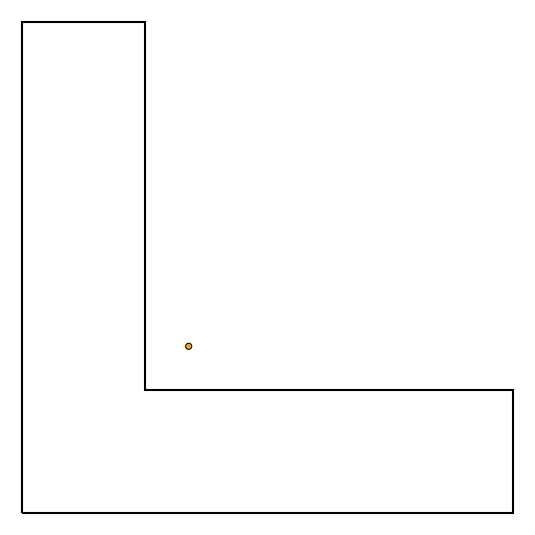

[](https://github.com/urschrei/polylabel-rs/actions/workflows/rust.yml) [](https://coveralls.io/github/urschrei/polylabel-rs?branch=master)
[](https://crates.io/crates/polylabel)
# Polylabel-rs
A Rust implementation of the [Polylabel](https://github.com/mapbox/polylabel) algorithm

The orange dot is the polygon centroid. The teal dot is the ideal label position. Red boxes show the search space.
[]()

You can generate this visualisation yourself by cloning this repo, switching to the [`visualise`](https://github.com/urschrei/polylabel-rs/tree/visualise) branch, and opening the [`visualise.ipynb`](https://github.com/urschrei/polylabel-rs/blob/visualise/visualise.ipynb) Jupyter notebook, then stepping through the cells. You can also easily visualise a Polygon of your own using the notebook.

## How to Use
```rust
extern crate polylabel;
use polylabel::polylabel;

extern crate geo;
use geo::{Point, Polygon};

let coords = vec![
    (0.0, 0.0),
    (4.0, 0.0),
    (4.0, 1.0),
    (1.0, 1.0),
    (1.0, 4.0),
    (0.0, 4.0),
    (0.0, 0.0)
];
let poly = Polygon::new(coords.into(), vec![]);
let label_pos = polylabel(&poly, &0.10);
// Point(0.5625, 0.5625)
```
## Command-Line Tool
A command-line tool is available: `cargo install polylabel_cmd`. This enables the `polylabel` command, which takes a GeoJSON file as input, as well as an optional (`-t / --tolerance`) tolerance value. See more at [crates.io](https://crates.io/crates/polylabel_cmd).

## Documentation
https://docs.rs/polylabel

## FFI
Call `polylabel_ffi` with the following three mandatory arguments:
- [`Array`](https://docs.rs/polylabel/1.0.3/polylabel/struct.Array.html) (a struct with two fields):
    - `data`: a void pointer to an array of two-element `c_double` arrays, each of which represents a point on the exterior Polygon shell)
    - `len`: the length of the `data` array, a `size_t`
- [`WrapperArray`](https://docs.rs/polylabel/1.0.3/polylabel/struct.WrapperArray.html) (a struct with two fields):
    - `data`: a void pointer to an array of `Array`s, each entry representing an interior Polygon ring. Empty if there are no rings.
    - `len`: the length of the `data` array, a `size_t`. 0 if it's empty.
- `tolerance`, a `c_double`

The function returns a [struct](https://docs.rs/polylabel/1.0.3/polylabel/struct.Position.html) with two `c_double` fields:
- `x_pos`
- `y_pos`

A Python example is available in [`ffi.py`](ffi.py)

An auto-generated header file is available at [`include/header.h`](include/header.h)

## Performance vs Accuracy
Using a 4-core 2.3 GHz Intel Core i5, finding a label position on a ~9k-vertex polygon (representing the Norwegian mainland) using a tolerance of `1.0` takes around 9 ms. Depending upon the dimensions of your polygon(s), you may require a higher tolerance (i.e. a smaller number). See [here](https://gis.stackexchange.com/questions/8650/measuring-accuracy-of-latitude-and-longitude/8674#8674) for some guidance on the accuracy provided by each decimal place.

## Binaries
Binary libs for:
- `x86_64` *nix (built using `manylinux1`, thus easy to include in Python 2.7 / 3.5 / 3.6 wheels) and OS X
- `i686` and `x86_64` Windows

are available in [releases](https://github.com/urschrei/polylabel-rs/releases).

## License
[MIT](license.txt)
